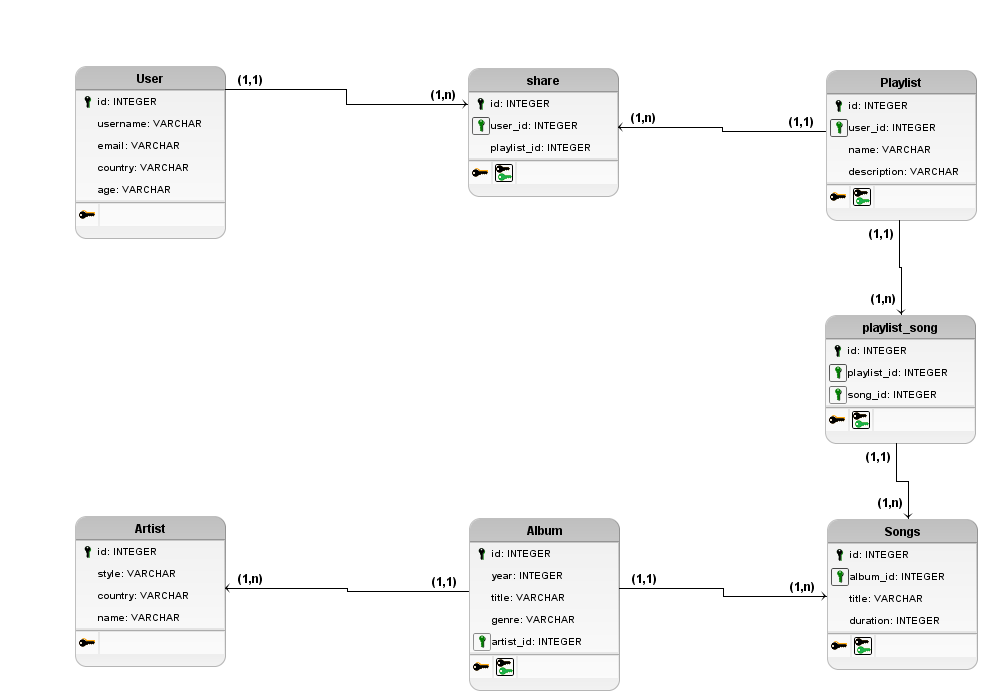

# Spotify API Clone with Knex.js

## ❓ Why?
- Learn the technology
- Query builder
- SQL query builder with Javascript
- Callback style or promise style
- Multiple platforms (PostgreSQL, MySQL, SQLite3 ...)
- Agility
- Help in all scenarios? No, but you can still write raw queries
- SQL Raw can be dangerous if not done carefully, it can be ugly and difficult to maintain
- Knex vs SQL Raw

## 💻 Technologies

- Nodejs
- PostgreSQL
- VSCode
- Insomnia
- KnexJs

## 🔨 Database Schema

